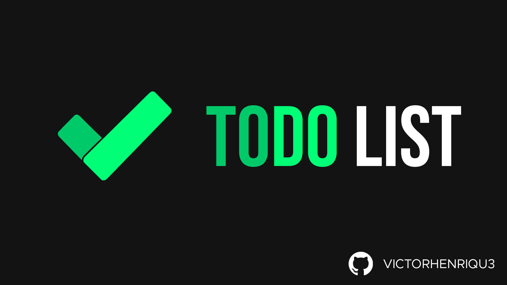
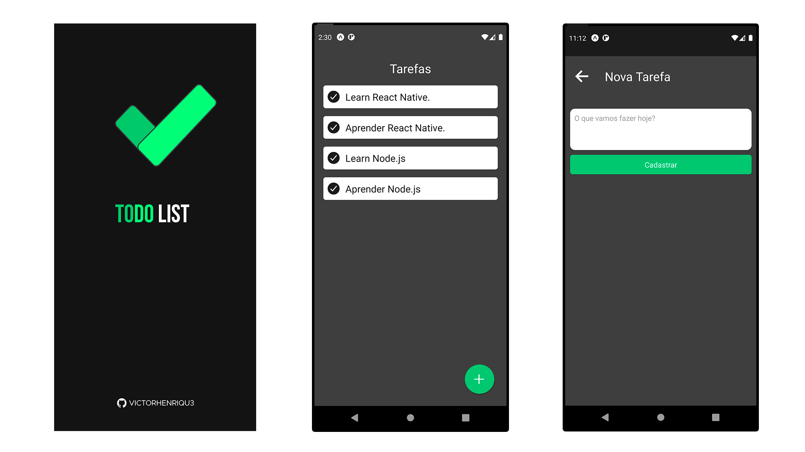

# ⚛️ React Native ToDo App

 

<h2 align="center"> Tabela de conteúdos </h2>

   <a href="#sobre">📄 Sobre</a> •
   <a href="#screenshots"> 📷 Screenshots</a> •
   <a href="#demonstração"> 📱 Demonstração</a> •
   <a href="#autor"> ✍ Autor</a> 

---

## Sobre:

Projeto desenvolvido com auxilio da Documentação oficial do [React Native](https://reactnative.dev), totalmente com o intuito educacional de praticar os conhecimentos adquiridos na tecnologia e implementar algumas ideias de UI Design baseados no [Material Design](https://material.io/design) do Google.

---

 

## Screenshots:

 
 

---

## Demonstração:

---

## Autor:

 
<a href="https://github.com/victorhenriqu3">
 
  
 <b style="font-size: 15px;">Victor Henrique 🚀</b></a>

Feito com ❤️ por Victor Henrique. 
👋🏽 Entre em contato!

